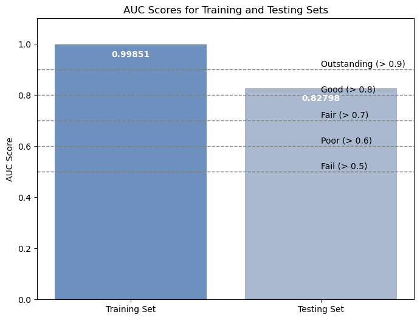
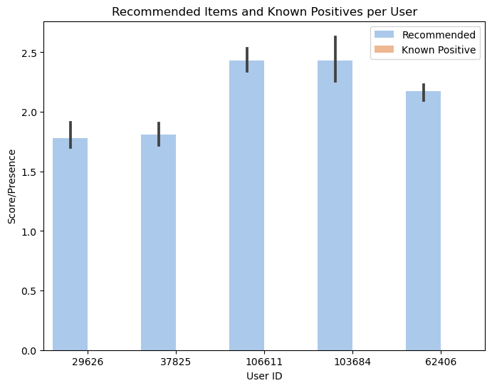

# 📊 模型评估与结果展示

本页总结了模型训练过程中的评估指标、结果可视化方式，以及项目结论与优化建议。

---

## 🎯 评估指标设计与选型

推荐系统的评估不宜使用传统分类指标（如 accuracy），而应采用能反映推荐排序质量的指标。我们选用了：

### ✅ AUC（Area Under ROC Curve）

- **含义**：反映模型在预测“用户对物品偏好”排序上的整体准确性
- **优势**：不依赖于阈值选择，适合无显式评分的隐反馈场景

---

## 📈 模型结果摘要

使用 LightFM 模型在 Retailrocket 数据集上的训练与测试结果如下：

| 指标         | 值          |
|--------------|-------------|
| AUC@Train    | 0.9985      |
| AUC@Test     | 0.8280      |
| 训练周期     | 100 轮（单线程） |

AUC 测试结果表明，该模型在用户历史行为上具有良好的排序能力，适合用作电商类商品推荐原型系统。

---

## 🖼 可视化分析

我们在 Notebook 中生成了两个关键图像，辅助理解模型预测质量与推荐表现：

### AUC 得分比较图

展示了 LightFM 模型在训练集与测试集上的 AUC 表现，测试集结果达到 0.828，属于“良好”推荐效果区间。

---

### 推荐质量分布图

展示了模型对部分用户推荐的物品数量与其真实正反馈数量之间的差异，验证推荐集中度与偏好覆盖率。

---

## ✅ 项目总结与优化建议

### 当前成果

- 构建并训练了一个混合推荐模型（LightFM），融合协同过滤与内容特征
- 使用真实用户行为数据进行训练和评估
- 模型在排序质量（AUC）上达成了良好效果，推荐结构具备一定解释性

### 后续优化方向

- 🔍 **增强特征设计**：如加入时间上下文、用户活跃度、商品层级信息
- 🧠 **算法参数调优**：探索 BPR 损失、调整正则项与维度
- 🌐 **部署演示系统**：构建 API 或简单前端进行用户模拟体验
- 📈 **引入线上评估机制**：如用户反馈机制或 A/B 测试框架，支持闭环优化

---

本项目展示了如何基于公开数据集与 Python 工具链，从数据建模、算法实现到评估分析构建完整的推荐系统原型，适合作为业务落地前的快速验证方案。
